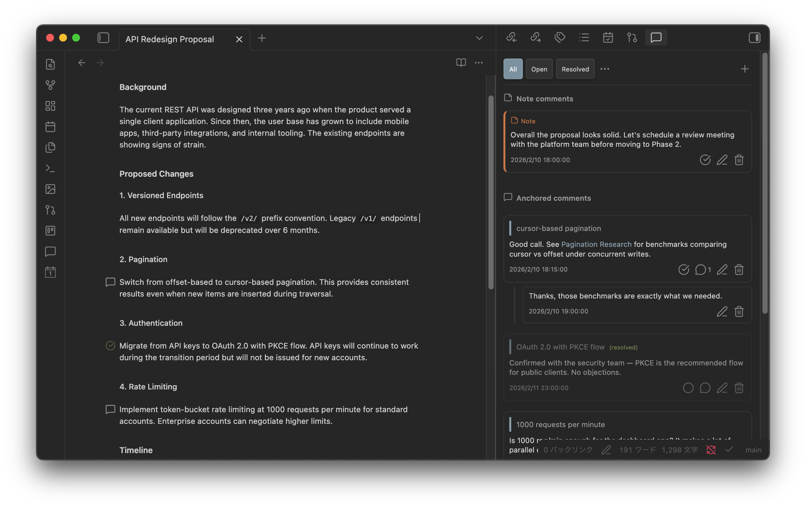

# Marginalia

Non-destructive margin comments and annotations for [Obsidian](https://obsidian.md).

<!--  -->

## Features

- **Non-destructive annotations** — Comments are stored as external sidecar JSON files. Your original `.md` files are never modified.
- **Anchored comments** — Select any text and attach a comment to it. The anchor survives edits thanks to smart text matching.
- **Note-level comments** — Add general comments to an entire note without selecting specific text.
- **Threaded replies** — Reply to any comment to create a conversation thread.
- **Resolve / unresolve** — Mark comments as resolved and bring them back when needed.
- **Gutter icons** — Commented lines are marked with icons in the editor gutter. Hover to preview.
- **Comment panel** — A dedicated sidebar panel lists all comments for the current note with filters: All / Open / Resolved / Active / Orphaned.
- **Smart text anchoring** — Uses a 3-stage matching strategy (line hint → context-scored search → fuzzy match) so anchors stay attached even after surrounding text is edited.
- **Markdown in comments** — Comment bodies support Markdown formatting, including `[[wikilinks]]`.
- **Desktop and mobile** — Works on all platforms Obsidian supports.

## Demo

## Installation

### Community plugins (recommended)

1. Open **Settings → Community plugins → Browse**.
2. Search for **Marginalia**.
3. Click **Install**, then **Enable**.

<!-- Community plugin listing is pending. Use manual installation for now. -->

### Manual installation

1. Download `main.js`, `styles.css`, and `manifest.json` from the latest release.
2. Create a folder `VaultFolder/.obsidian/plugins/marginalia/`.
3. Copy the three files into that folder.
4. Reload Obsidian and enable **Marginalia** in **Settings → Community plugins**.

## Usage

### Adding an anchored comment

1. Select text in the editor.
2. Right-click and choose **Add comment to selection**, or run the command from the Command Palette.
3. Type your comment and submit.

The selected text becomes the anchor — a gutter icon appears on that line.

### Adding a note comment

Run the **Add note comment** command from the Command Palette, or click the "+" button in the comment panel. Note comments are attached to the file, not to specific text.

### Viewing comments

Open the comment panel with the **Open comment panel** command, or click the Marginalia icon in the left ribbon. The panel shows all comments for the active note.

Use the filter menu to switch between views:

| Filter | Shows |
| -------- | ------- |
| All | Every comment |
| Open | Unresolved comments |
| Resolved | Resolved comments |
| Active | Comments anchored to text (not orphaned) |
| Orphaned | Comments whose anchor text can no longer be found |

### Resolving and replying

- Click the checkmark on a comment to resolve it. Click again to unresolve.
- Click the reply button to add a threaded reply.

### Navigating between comments

Use **Go to next comment** / **Go to previous comment** to jump between commented positions in the editor.

## Commands

| Command | Description |
| --------- | ------------- |
| Add comment to selection | Attach a comment to the currently selected text |
| Add note comment | Add a comment to the current note (not anchored to text) |
| Open comment panel | Open the comment sidebar panel |
| Go to next comment | Move the cursor to the next comment position |
| Go to previous comment | Move the cursor to the previous comment position |

## Settings

| Setting | Options | Default | Description |
| --------- | --------- | --------- | ------------- |
| Storage location | Plugin folder (`comments/`) / Vault root (`.marginalia/`) | Plugin folder | Where comment data is stored. A migrate button moves existing data when changed. |
| Comment sort order | Position in file / Creation date | Position in file | How comments are ordered in the sidebar panel. |
| Show gutter icons | On / Off | On | Display comment indicators in the editor gutter. |
| Fuzzy match threshold | 0.1 – 0.5 (slider) | 0.3 | Maximum edit distance ratio for fuzzy anchor matching. Lower = stricter. |
| Orphaned comment handling | Keep and notify / Delete automatically | Keep and notify | What happens when a comment's target text can no longer be found. |

## How Comments Are Stored

Marginalia never touches your `.md` files. All comment data is stored as JSON in a separate location:

- **Plugin folder** (default): `VaultFolder/.obsidian/plugins/marginalia/comments/`
- **Vault root**: `VaultFolder/.marginalia/`

Each note with comments gets its own JSON file. An `_index.json` file maps vault file paths to comment files. Vault rename and delete events are tracked automatically to keep everything in sync.

You can switch between storage locations in Settings — use the migrate button to move existing data.

## License

[0-BSD](LICENSE)
